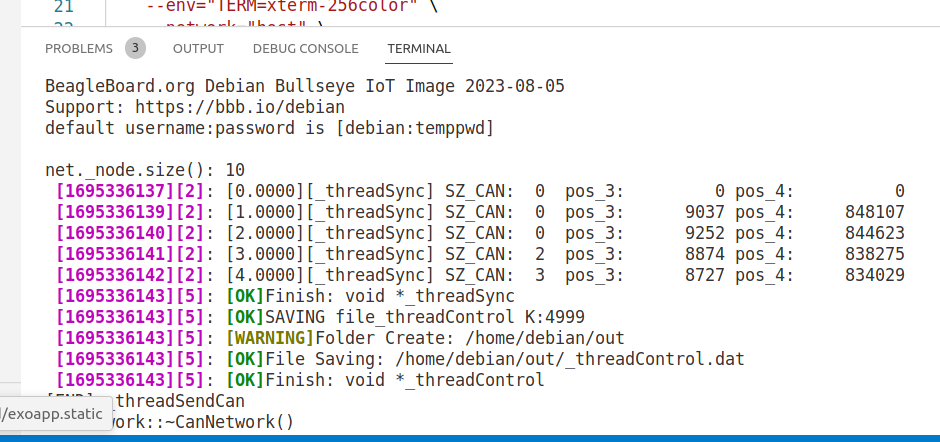
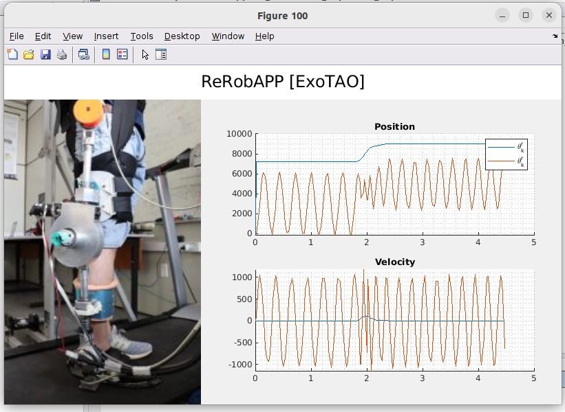
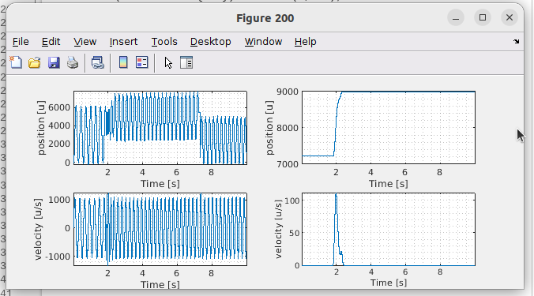
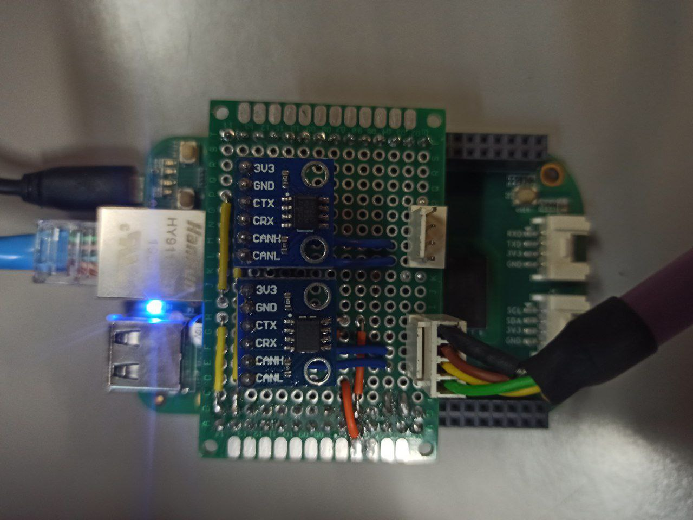

# RerobAPP
The goal of this project is to create a real-time framework for microprocessors, facilitating its implementation in research environments and enabling interaction with multiple devices. This comprehensive framework features real-time capabilities, multiple devices interaction, real-time system visualization, data storage, error handling, offline data visualization, and remote administration, making it a tool for various applications.

- [RerobAPP](#rerobapp)
    - [Remote monitoring server](#remote-monitoring-server)
    - [Real-time visualization (Matlab)](#real-time-visualization-matlab)
    - [Offline Data Visualization (Matlab)](#offline-data-visualization-matlab)
    - [Simple control task (Test)](#simple-control-task-test)
- [Beaglebone](#beaglebone)
    - [Configure the Beaglebone](#configure-the-beaglebone)
    - [CAN Bus Configuration with VP230 Modules](#can-bus-configuration-with-vp230-modules)
    - [Connect to network](#connect-to-network)
    - [ssh with out password](#ssh-with-out-password)
    - [Real-Time Patch Installation for BeagleBone](#real-time-patch-installation-for-beaglebone)
- [Docker](#docker)
    - [Configurating Docker](#configurating-docker)
- [Vscode](#vscode)

### Remote monitoring server
<!--  -->
<p align="center">

</p>

### Real-time visualization (Matlab)
<!--  -->
<p align="center">

</p>


### Offline Data Visualization (Matlab)
<!--  -->
<p align="center">

</p>

### Simple control task (Test)
<!--  -->
<p align="center">

</p>

# Beaglebone

The choice of BeagleBone as our development platform is driven by its versatile features, making it an ideal choice for real-time applications. But remember that you can use any compatible board. This project has only been tested on Beaglebone Green.


<!--  -->
<p align="center">

</p>

### Configure the Beaglebone

Flashing the eMMC with an official image from [Beaglebone.org](https://www.beagleboard.org/distros), in this case the image [AM335x Debian 11.7 2023-08-05 4GB eMMC IoT Flasher](https://www.beagleboard.org/distros/am335x-debian-11-7-2023-08-05-4gb-emmc-iot-flasher) was used for the Beaglebone Green. 

If you want root access, please remember that Beaglebone images have the default *[username:password]* is `debian:temppwd`.


### CAN Bus Configuration with VP230 Modules

This project utilizes two VP230 modules to establish a CAN bus topology. The pins have been connected as follows:

- `can0_rx` connected to pin 19.
- `can0_tx` connected to pin 20.
- `can1_rx` connected to pin 24.
- `can1_tx` connected to pin 26.

To activate the CAN interfaces in this system, you need to execute the `configure.sh` script. Make sure the script is run with the appropriate permissions: `$ sudo ./configure.sh`


### Connect to network
if your board has an Ethernet interface, connect the cable, if you have wifi, run the following script to connect to a wireless network:

```bash
$ wpa_cli -i wlan0
    scan
    scan_result
    add_network
    set_network 1 ssid "{YOUR_SSID}"
    set_network 1 psk "{YOUR_PASSWD}"
    enable_network 1
    save_config
    quit
$ sudo dhclient wlan0
```
Otherwise, if you wish, connect a usb cable to your computer, the ip address `192.168.6.2` will be the address of your board in the case of a Beaglebone.

### ssh with out password
Execute the following commands to save your computer, as a known host inside the board, so you don't need to insert the password in every transaction with the board.

```bash
$ ssh-keygen
$ ssh-copy-id $REROBAPP_SSH_USER
```
### Real-Time Patch Installation for BeagleBone

Many of the libraries and packages are already installed by default on the BeagleBone, including OpenCAN, G++, CMake, and Git. However, the real-time patch may not be installed by default.

You can check if you have the real-time patch installed by running the following command: 
```bash 
$ uname -a
```
Check if it displays *#1bullseye SMP PREEMPT.* If it doesn't, you can install the real-time patch by executing the following command:

```bash
$ sudo apt-cache search linux-image
$ sudo apt install bbb.io-kernel-6.1-bone-rt -y
```

This command will search for available Linux kernel images and install the real-time patch for your BeagleBone. After installation, don't forget to restart your BeagleBone for the changes to take effect.


# Docker
In this framework, we leverage Docker as a fundamental tool to speed up the compilation process and reduce the load on the board. Install docker with the help of the documentation available on its [official website]([https://](https://docs.docker.com/engine/install/ubuntu/))

### Configurating Docker
This command build a Docker image `beaglebone2023:lasted`, that includes all the necessary libraries and packages for your project. 

```bash
cd docker
source ./scripts/init
```


# Vscode

Install the `VsCode Action Buttons` extension, to place Build and Run buttons.
<!--  -->
<p align="center">

</p>

Press `[shift] + [ , ]` and modify the .json file, with the following settings

```json
{
    "name": "Build",
    "command": "./build.sh"
},
{
    "name": "Run",
    "command": "ssh -t $REROBAPP_SSH_USER ./build/{YOUR_APPLICATION}"
}
```


---
by [Yecid Moreno](https://github.com/YecidMorenoUSP)